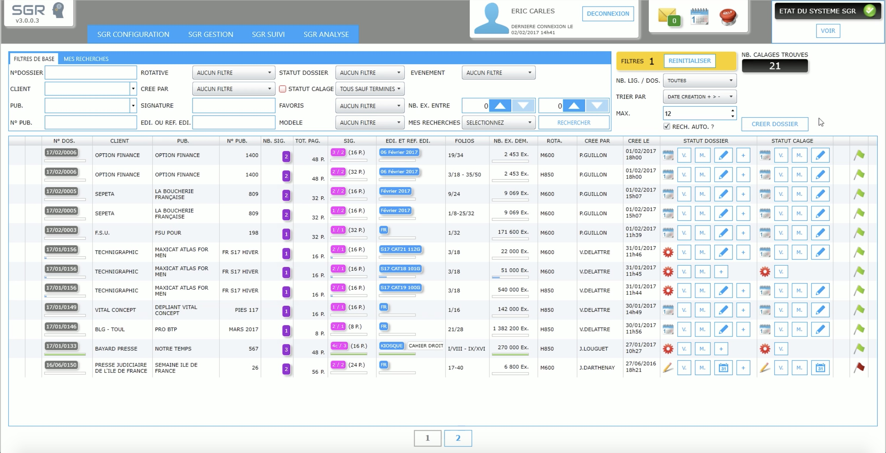
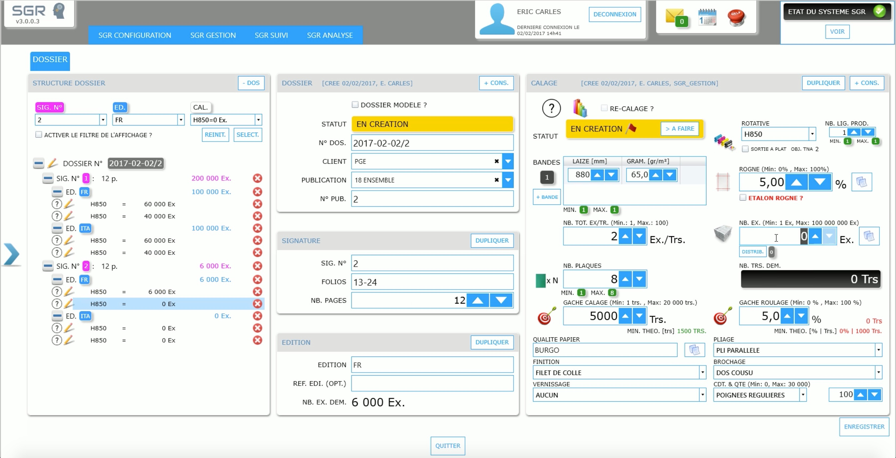
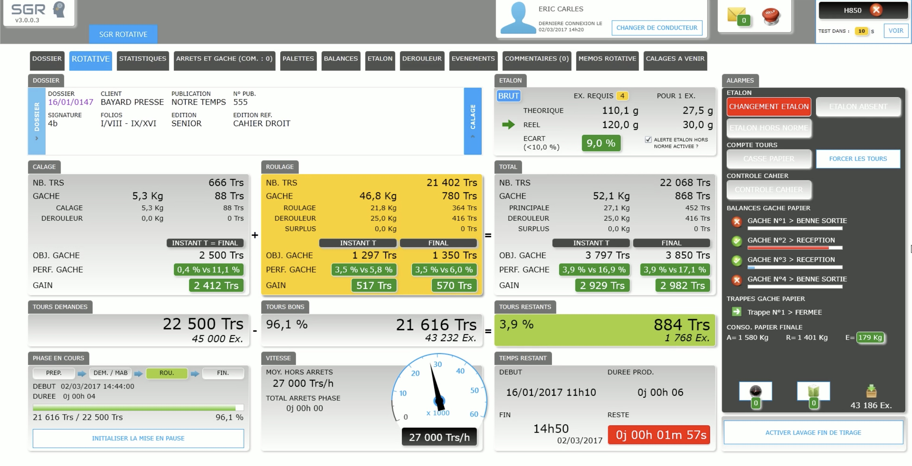
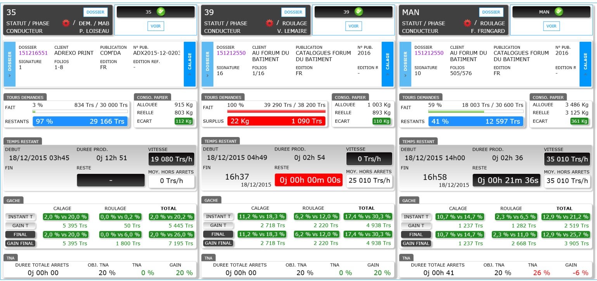
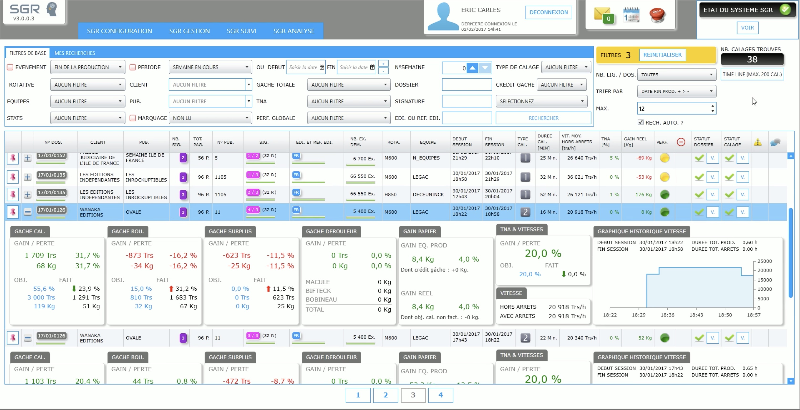
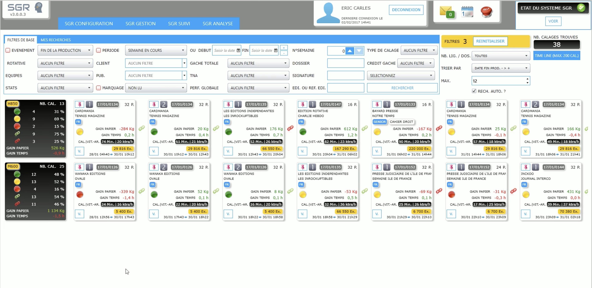
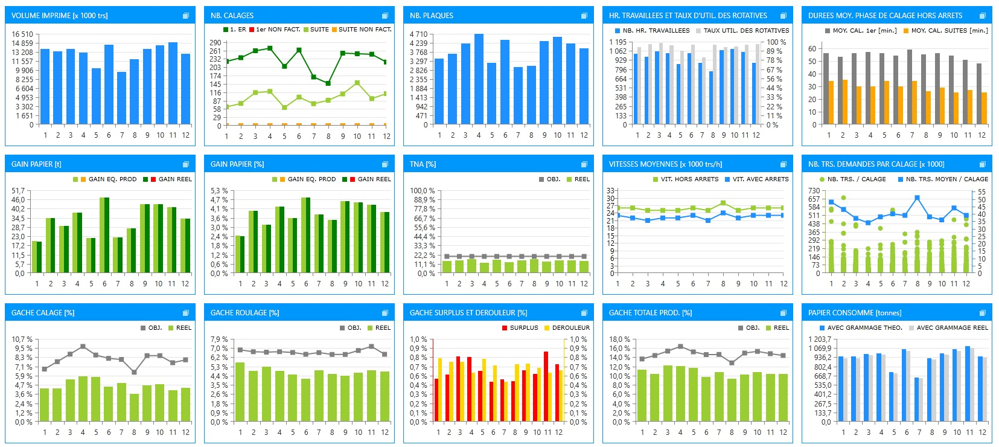

# A production management and supervision system for the printing industry

## What the system aims at solving
The printing industry is being challenged by the increasing price of resources like paper, ink and energy meanwhile 
clients are asking for lower prices. A part of the solution to deal with this situation is to optimize 
the productivity. One leverage to to do so is to reduce as much as possible the resources consumed 
as input for a same amount of output.

## What the system provides
I have implemtented a system to help this industry to deal with this situation. The SGR system provides the opportunity to improve
the productivity by facilitating the decision making. The SGR system :
- Provides real time production indicators to produce the required quantity and avoid wasting resources 
- Tracks the production incidents and identify the weaknesses helping the maintenance team to prioritize their actions 
- Allows all the teams to share the same information in order to communicate and organise more efficiently
- Helps the decision makers to refine their strategy and choice of investment by prodviding more than 50 different PKIs

## Technical stack
I have used the .NET stack :
- C#, Entities, Linq
- MSSQL Express
- XAML and the Telerik framework for user interfaces
- Windows Services

## Feature examples

### Manage the jobs before production 

The jobs to produce can be easily managed through this interface, the team in charge of preparing them can in 1 click change the status of a job to make it available in production for instance.

The can rely on very effective fucntionalities like duplication to avoid filling out similar jobs. As a result, even a complicated job can be recorded in 1 minute.

### Monitor the ongoing jobs

The production teams monitor in real-time the ongoing job on their rotary. The system delivers all the indicators they need to produce the  required quantity and save resources.

The responsables of production can oversee in real-time the ongoing production on all the rotaries at the same time.

### Check the completed jobs

The responsables of production can check quickly the stats of the ongoing or completed jobs.

Another view is provided to check the completed jobs following an horizontal time-line

### Analysis production trends over the time

The decision makers can rely on the provided analysis module to find out more about the production trends over the time by exploring more than 50 PKIs through data tables, figures and dashboard.

